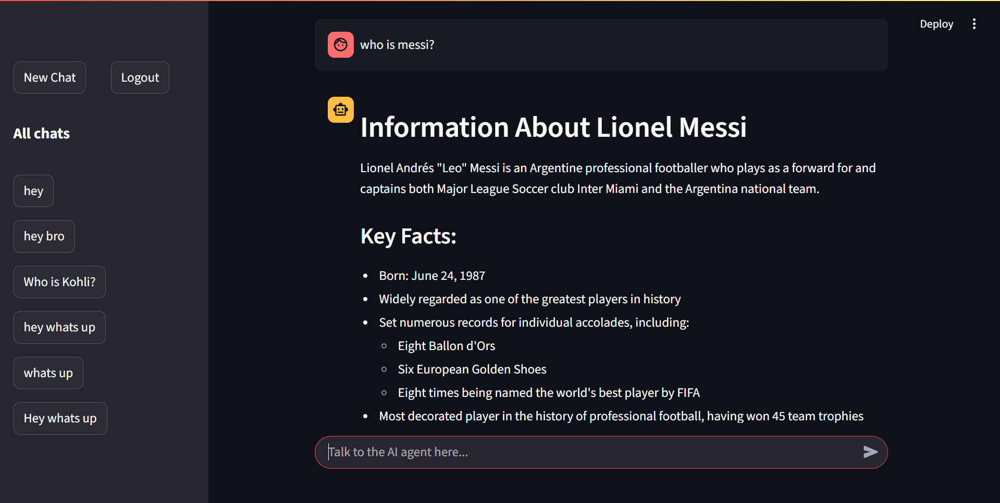
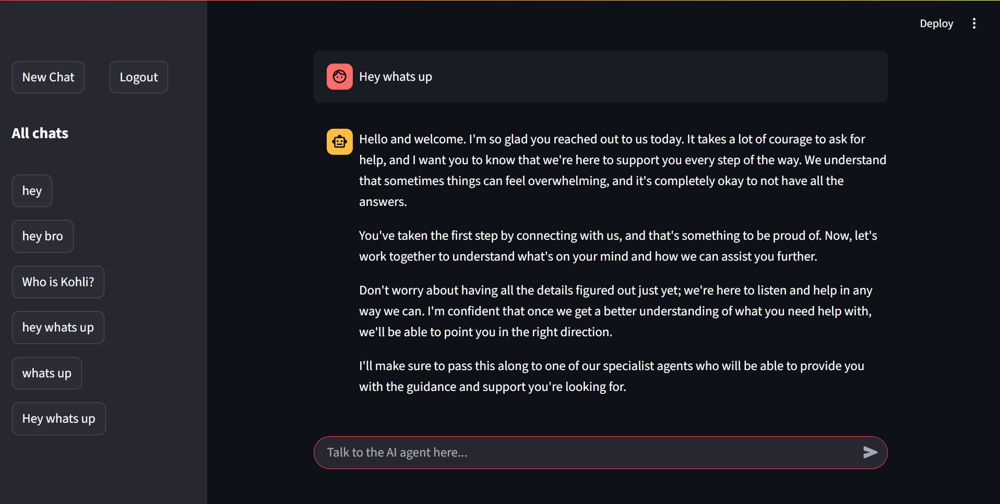
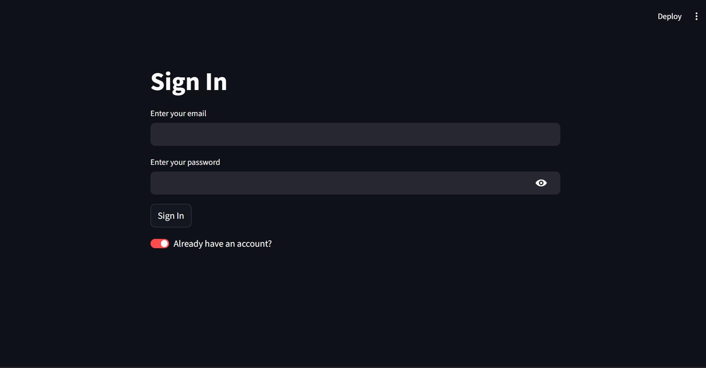

# Supervisor Multi-Agent AI Platform

Most chatbots call one model and hope it can handle every task. This project takes a different approach: a LangGraph supervisor routes each user request to the right specialist agent, streams the response in real time, and persists authenticated chat sessions through Supabase.


## Table of Contents

- [Core Tech Stack](#core-tech-stack)
- [Project Overview](#project-overview)
- [Preview](#preview)
- [Features](#features)
- [Agent System](#agent-system)
- [Engineering Decisions](#engineering-decisions)
- [Architecture](#architecture)
- [API Endpoints](#api-endpoints)
- [Configuration](#configuration)
- [Project Structure](#project-structure)
- [Quick Start](#quick-start)
- [Docker](#docker)
- [Google Cloud Deployment](#google-cloud-deployment)
- [CI/CD Pipeline](#cicd-pipeline)
- [Roadmap](#roadmap)

## Core Tech Stack


## Project Overview

Supervisor Multi-Agent AI Platform is a full-stack agentic AI application demonstrating:

- LangGraph supervisor orchestration
- Specialist agents for greeting, query refinement, coding, math reasoning, and research
- Tool execution with Tavily, DuckDuckGo, Wikipedia, PubMed, Python REPL, and calculator
- FastAPI backend with server-sent event streaming
- Streamlit chat UI with authentication
- Supabase Auth and chat persistence
- JWT validation for protected API routes
- Optional Postgres-backed LangGraph checkpointing
- Structured JSON logging for cloud logs
- Dockerized backend and frontend services
- Google Cloud Build and Cloud Run deployment

## Preview

| Chat UI | Streaming Chat |
|---|---|
|  |  |

| User Auth | Agent Workflow |
|---|---|
|  |  |

| FastAPI | LangSmith |
|---|---|
|  |  |

## Features

### Multi-Agent Routing

The supervisor agent classifies the user request and routes it to the most relevant specialist:

- Greeting agent for conversational onboarding
- Enhancer agent for refining vague prompts
- Coder agent for code generation and debugging
- Maths reasoner for symbolic, numerical, and logical reasoning
- Researcher for factual lookup and external knowledge gathering

### Tool Execution Layer

Specialist agents can request tools when needed:

- Tavily for web search
- DuckDuckGo for lightweight search fallback
- Wikipedia for encyclopedic knowledge
- PubMed for biomedical and academic research
- Python REPL for code execution
- Calculator for numeric expressions through `numexpr`

### Authentication and Persistence

- Supabase email/password sign-in and sign-up
- Backend JWT validation using Supabase issuer, audience, and signing keys
- Protected chat APIs with `Authorization: Bearer <token>`
- Session history persisted per authenticated user
- Token refresh endpoint for expired sessions

### Real-Time Chat Streaming

The backend exposes `/chat_stream` as a server-sent events endpoint. The Streamlit UI consumes the stream incrementally and renders partial model output as it arrives.

### Deployment Ready

- Separate backend and frontend Dockerfiles
- `docker-compose.yml` for local multi-service execution
- `cloudbuild.yaml` for building and deploying both services to Google Cloud Run
- Secret Manager integration for API keys and Supabase credentials

## Agent System

```text
Client
  |
  v
Streamlit UI
  |
  v
FastAPI /chat_stream
  |
  v
LangGraph Supervisor
  |
  +--> Greeting Agent
  +--> Enhancer Agent
  +--> Coder Agent
  +--> Maths Reasoner
  +--> Researcher
          |
          v
   Tool Execution Layer
   Tavily / DuckDuckGo / Wikipedia / PubMed / Python REPL / Calculator
  |
  v
SSE Streamed Response
```

## Engineering Decisions

### Why a supervisor graph?

A single general-purpose model can answer many questions, but it does not give clear control over task routing. LangGraph makes the workflow explicit: the supervisor chooses a specialist, specialists can call tools, and tool results return to the originating agent.

### Why FastAPI and Streamlit?

FastAPI handles authenticated API routes, streaming, health checks, and backend-owned persistence. Streamlit keeps the frontend lightweight while still supporting chat UX, auth flow, session history, and streaming updates.

### Why Supabase?

Supabase provides both authentication and database persistence. This keeps identity, JWT validation, and chat storage in one system while still allowing backend-controlled database writes through the service key.

### Why server-sent events?

SSE is simpler than WebSockets for one-way LLM streaming. The client sends one request, then receives incremental chunks until the backend emits an end event.

### Why optional Postgres checkpointing?

For local development, `MemorySaver` keeps the setup simple. In production, `SUPABASE_DB_URL` enables LangGraph Postgres checkpointing so conversation state can survive process restarts.

## Architecture

### Backend Flow

```text
POST /chat_stream
  |
  +-- Validate Supabase JWT
  |
  +-- Resolve thread_id
  |
  +-- Load previous LangGraph state
  |
  +-- Append HumanMessage
  |
  +-- Stream LangGraph events
  |
  +-- Emit SSE chunks to client
```

### Session Persistence Flow

```text
User message
  |
  +-- Streamlit saves human message through POST /api/sessions/chat
  |
  +-- Backend writes to Supabase session table
  |
  +-- Agent streams response
  |
  +-- Streamlit saves AI response through POST /api/sessions/chat
  |
  +-- Sidebar reloads session summaries
```

## API Endpoints

| Endpoint | Method | Auth | Purpose |
|---|---|---|---|
| `/` | GET | No | Service welcome response |
| `/health` | GET | No | Health and uptime check |
| `/chat_stream` | POST | Yes | Stream agent response over SSE |
| `/api/auth/refresh` | POST | No | Refresh Supabase session token |
| `/api/sessions` | GET | Yes | List user chat sessions |
| `/api/sessions/{session_id}` | GET | Yes | Fetch chat history for a session |
| `/api/sessions/chat` | POST | Yes | Persist one chat message |

## Configuration

Create a `.env` file with the required values.

| Variable | Required | Description |
|---|---|---|
| `OPENROUTER_API_KEY` | Yes | API key for OpenRouter model access |
| `SUPABASE_URL` | Yes | Supabase project URL |
| `SUPABASE_KEY` | Yes | Supabase anon key used by frontend auth |
| `SUPABASE_SERVICE_KEY` | Yes | Supabase service role key used by backend DB operations |
| `SUPABASE_JWT_SECRET` | Yes | JWT secret for HS256 Supabase tokens |
| `SUPABASE_DB_URL` | No | Postgres URL for LangGraph checkpointing |
| `TAVILY_API_KEY` | No | Enables Tavily web search tool |
| `LANGCHAIN_TRACING_V2` | No | Enables LangSmith tracing |
| `LANGCHAIN_ENDPOINT` | No | LangSmith endpoint |
| `LANGCHAIN_API_KEY` | No | LangSmith API key |
| `LANGCHAIN_PROJECT` | No | LangSmith project name |
| `LLM_PROVIDER` | No | `openrouter`, `groq`, or `openai` |
| `LLM_MODEL` | No | Model name, defaults to `gpt-4o-mini` |
| `LLM_TEMPERATURE` | No | Model temperature, defaults to `0.2` |
| `BACKEND_URL` | Frontend | Backend API URL for Streamlit |
| `CORS_ORIGINS` | No | Comma-separated allowed origins |

## Project Structure

```text
├── backend/
│   ├── ai_agent.py              # LangGraph graph construction and checkpointing
│   ├── auth.py                  # Supabase JWT validation dependencies
│   ├── fastapi_backend.py       # FastAPI app, routes, streaming endpoint
│   └── supabase_database.py     # Supabase auth and chat persistence helpers
├── frontend/
│   └── streamlit_frontend.py    # Streamlit auth, chat UI, SSE client
├── assets/
│   ├── chatbot_ui_1.png
│   ├── chatbot_ui_2.png
│   ├── user_auth.png
│   ├── workflow.png
│   ├── fastapi.png
│   └── langsmith.png
├── utils.py                     # Agent state, tools, LLM factory, graph nodes
├── requirements.txt             # Shared dependencies
├── requirements-backend.txt     # Backend dependencies
├── requirements-frontend.txt    # Frontend dependencies
├── Dockerfile.backend           # Backend image
├── Dockerfile.frontend          # Frontend image
├── docker-compose.yml           # Local backend/frontend orchestration
├── cloudbuild.yaml              # Google Cloud Build and Cloud Run deployment
└── README.md
```

## Quick Start

### 1. Clone

```bash
git clone https://github.com/aniketsarapAI/Supervisor-Multi-Agent.git
cd Supervisor-Multi-Agent
```

### 2. Create environment file

Create `.env` manually using the variables from the configuration table.

### 3. Install backend dependencies

```bash
pip install -r requirements-backend.txt
```

### 4. Start the backend

```bash
uvicorn backend.fastapi_backend:app --reload --port 8000
```

### 5. Install frontend dependencies

```bash
pip install -r requirements-frontend.txt
```

### 6. Start the frontend

```bash
streamlit run frontend/streamlit_frontend.py
```

The Streamlit app runs on:

```text
http://localhost:8501
```

The FastAPI docs run on:

```text
http://localhost:8000/docs
```

## Docker

Run both services locally:

```bash
docker compose up --build
```

Services:

| Service | URL |
|---|---|
| Backend API | `http://localhost:8000` |
| Streamlit UI | `http://localhost:8501` |

## Google Cloud Deployment

This repo includes `cloudbuild.yaml` for Google Cloud Build and Cloud Run. Deployment to production is fully automated using Google Cloud Build. See the **CI/CD Pipeline** section below for the deployment workflow.

The deployment builds and pushes:

- `sma-api` from `Dockerfile.backend`
- `sma-ui` from `Dockerfile.frontend`

The backend is deployed first. Cloud Build captures the backend Cloud Run URL and injects it into the frontend as `BACKEND_URL`.

Secrets expected in Google Secret Manager:

- `sma-openrouter-key`
- `sma-tavily-key`
- `sma-supabase-url`
- `sma-supabase-anon-key`
- `sma-supabase-service-key`
- `sma-jwt-secret`
- `sma-supabase-db-url`
- `sma-langsmith-key`

## CI/CD Pipeline

### Overview

This project uses Google Cloud Build, GitHub, Artifact Registry, and Cloud Run to automatically build and deploy the application to production whenever code is pushed to the `main` branch. The entire deployment process is fully automated, eliminating the need for manual Docker builds or Cloud Run deployments.

### Architecture

```text
Developer
      │
git push origin main
      │
      ▼
GitHub
      │
      ▼
Cloud Build Trigger
      │
      ▼
Build Backend Image
      │
      ▼
Build Frontend Image
      │
      ▼
Push Images to Artifact Registry
      │
      ▼
Deploy sma-api
      │
      ▼
Retrieve Backend URL
      │
      ▼
Deploy sma-ui
      │
      ▼
Production Updated
```

### Deployment Workflow

#### 1. Developer Pushes Code

After completing development locally:

```bash
git add .
git commit -m "Implemented feature"
git push origin main
```

Pushing to the `main` branch automatically starts the deployment pipeline.

#### 2. Cloud Build Trigger

A Cloud Build trigger is configured with:

- Repository: `aniketsarapAI/Supervisor-Multi-Agent`
- Event: Push to branch
- Branch regex: `^main$`

Whenever GitHub receives a push to `main`, Cloud Build starts automatically.

#### 3. Cloud Build Executes `cloudbuild.yaml`

Cloud Build reads the repository's `cloudbuild.yaml` file and performs the deployment steps.

#### 4. Build Docker Images

Two Docker images are built:

| Image | Dockerfile | Service |
|---|---|---|
| `sma-api` | `Dockerfile.backend` | Backend |
| `sma-ui` | `Dockerfile.frontend` | Frontend |

#### 5. Push Images to Artifact Registry

The newly built Docker images are uploaded to Google Artifact Registry:

```text
us-central1-docker.pkg.dev/<PROJECT_ID>/supervisor-multi-agent/sma-api
us-central1-docker.pkg.dev/<PROJECT_ID>/supervisor-multi-agent/sma-ui
```

Artifact Registry stores versioned container images used by Cloud Run.

#### 6. Deploy Backend

Cloud Build deploys the backend service first. During deployment it:

- Creates a new Cloud Run revision
- Injects Secret Manager secrets
- Configures environment variables
- Routes traffic to the new healthy revision

Injected configuration includes OpenRouter API key, Tavily API key, Supabase credentials, LangSmith API key, and LLM configuration.

#### 7. Obtain Backend URL

After deployment succeeds, Cloud Build retrieves the backend URL dynamically:

```bash
gcloud run services describe sma-api
```

Example:

```text
https://sma-api-xxxxx-uc.a.run.app
```

#### 8. Deploy Frontend

The frontend is deployed after the backend. The backend URL is injected into the frontend environment:

```text
BACKEND_URL=https://sma-api-xxxxx-uc.a.run.app
```

This ensures the frontend always communicates with the latest backend deployment.

#### 9. Production Update

Once both deployments complete successfully, backend and frontend traffic is switched to the newest revisions. The production application is updated automatically.

### Google Cloud Services

| Service | Purpose |
|---|---|
| GitHub | Source code management |
| Cloud Build | Continuous Integration & Deployment |
| Artifact Registry | Container image storage |
| Cloud Run | Container hosting |
| Secret Manager | Secure secret storage |

### Secrets Management

Sensitive credentials are never stored in the repository. All production secrets are stored in Google Secret Manager and injected during deployment.

This includes:

- OpenRouter API key
- Tavily API key
- Supabase URL
- Supabase anon key
- Supabase service key
- Supabase JWT secret
- Supabase database URL
- LangSmith API key

### Automatic Deployment

The Cloud Build trigger is configured to watch the `main` branch. Every push to `main` automatically starts the build and deployment pipeline.

No manual deployment is required. Example:

```bash
git add .
git commit -m "Added authentication persistence"
git push origin main
```

Within a few minutes, the production environment is updated automatically.

### Rollback

Cloud Run retains previous revisions. If a deployment introduces an issue, traffic can be shifted back to any previous healthy revision from the Cloud Run console without rebuilding or redeploying the application.

### Benefits

- Automated production deployments
- Versioned container images
- Secure secret management
- Cloud-native deployment
- Simple rollback
- No manual deployment after pushing to `main`

## Roadmap

### Production Hardening

- Add `.env.example` with documented safe defaults
- Add automated backend tests for auth, sessions, and streaming
- Add frontend smoke tests
- Add rate limiting on chat and session endpoints
- Add request and response validation for tool outputs
- Add structured error responses across all endpoints

### Agent Improvements

- Add stronger output validation for each specialist agent
- Add evaluator or critic node for high-risk responses
- Add explicit source citations for researcher outputs
- Add safer execution boundaries around Python REPL
- Add configurable provider fallback between OpenRouter, Groq, and OpenAI

### Platform Improvements

- Add Redis or Postgres-backed rate limiting
- Add metrics endpoint for request count, latency, errors, and active streams
- Add OpenTelemetry tracing
- Add automated linting (Ruff)
- Add automated unit and integration tests
- Add deployment health checks and quality gates
- Add staging environment
- Add canary/blue-green deployments
